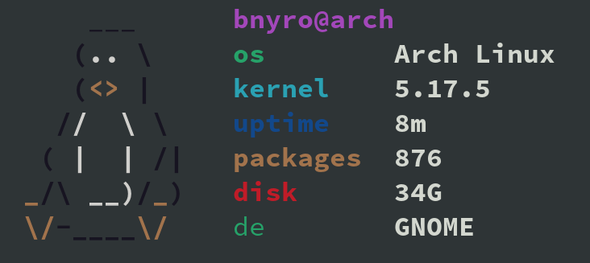

# bfetch

Simple System Info Script to run on terminal startup written in Bash\
You can add RAM Usage and other infos by editing the script\
ASCII credits go to pfetch and ufetch

## Demo



## Installation

```
git clone https://github.com/Bnyro/bfetch.git
cp bfetch/bfetch /usr/local/bin/
sudo chmod +x /usr/local/bin/bfetch
```
