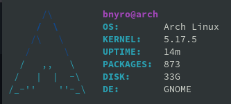

# bfetch

Simple System Info Fetch written in Bash to work on Linux devices\
ASCII credits go to pfetch by dylanaraps

## Demo



## Installation

```
git clone https://github.com/Bnyro/bfetch.git
cp bfetch/bfetch /usr/local/bin/
sudo chmod +x /usr/local/bin/bfetch
```
